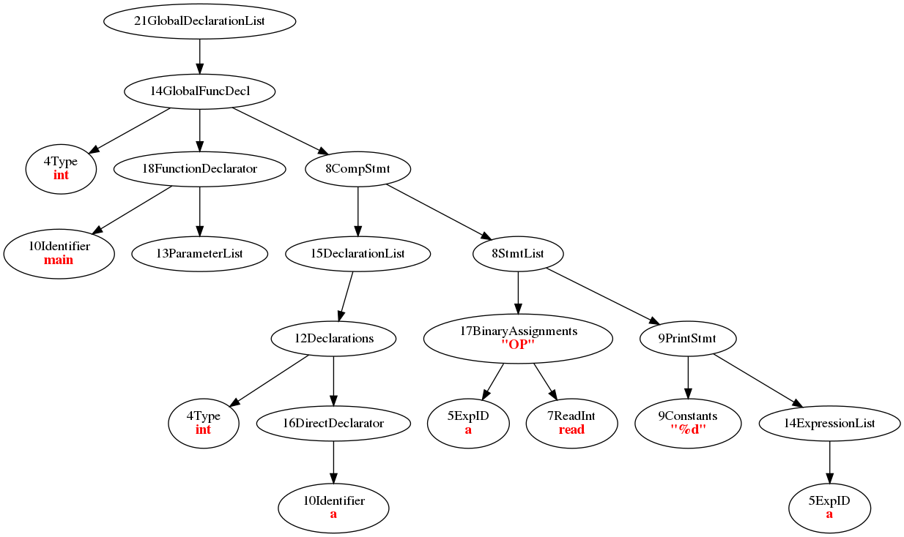

# <center> C亖亖 编译器实验报告 </center>

<center> 王晨宇 3180104919 </center>

> 亖这个子念“四”，意为 C-------- 记录了删减c语言语法的过程

*在本文档附录和README中有运行方式，在测试报告中描述了所有测试样例和结果*

## 一、运行环境与开发工具

```
- OS:       Ubuntu 18.04.5 LTS
- GCC:      gcc version 7.5.0 (Ubuntu 7.5.0-3ubuntu1~18.04) 
- Bison:    bison (GNU Bison) 3.7.6
- Flex:     flex 2.6.4
- IDE:      CLion 2021.1.2
- CMAKE:    3.10.2
- NASM: 	2.13.02
```


## 二、词法分析

### 1. 关键字

```
void, int, while, if, else, return, break, continue, print, read
```

### 2. 特殊符号

```
+, -, *, /, %, ==, !=, >, <, >=, <=, &&, ||, !, -
```

### 3. 数据类型和标识符

支持整型和字符串常量（但是不支持字符串类型变量）

- **string**   `\042[^\042\n]*\042`
- **integer** 	`{DECIMAL_CONSTANT}{INTEGER_SUFFIX}?|{OCTAL_CONSTANT}{INTEGER_SUFFIX}?|{HEXADECIMAL_CONSTANT}{INTEGER_SUFFIX}?`
- **identifier** `{NONDIGIT}+({DIGIT}|{NONDIGIT})*`

### 4. 注释

支持`//`开头的单行注释和由`/**/`包括的多行注释

并对多行注释的完整性进行检查

```c
void comment_check() {
	char c, prev = 0;
	while ((c = yyinput()) != 0) { 
		if (c == '/' && prev == '*')
			return;
		prev = c;
	}
	yyerror("Syntax Error: Improper Comments");
}
```


## 三、语法分析

语法分析程序从词法识别程序中获取记号形式的源代码，并完成定义程序结构的语法分析（syntax analysis 或者parsing）。本模块的输入是单词流，输出是语法树

本模块中利用Bison进行语法分析。

### 1. 语法规则

#### 1.1 数据类型

只支持int类型。为了语义分析的完整性考虑引入了字符串常量

支持全局变量，只有局部变量，变量须先声明再使用，且变量声明必须放在函数体或语句体(Compound Statement)的最前面

支持变量作用范围。

#### 1.2 数据运算

支持下列算术、逻辑运算

```
+, -, *, /, %, ==, !=, >, <, >=, <=, &&, ||, !, -
```

#### 1.3 赋值语句

赋值语句中左边为变量名，右边为表达式，不支持','连接的多个赋值语句。

#### 1.4 控制语句

支持if/else语句

执行体必须带上`{}`

#### 1.5 循环语句

支持while语句的循环语句，在循环中支持continue和break。

执行体必须带上`{}`

#### 1.6 函数调用

支持函数调用及递归。当没有显式为函数返回值时默认返回0；

### 2. 语法描述

```
Grammar

$accept: program $end

program: external_var_list external_declaration_list

external_var_list: %empty
                 | external_var_list declaration

external_declaration_list: external_declaration
                         | external_declaration external_declaration_list

external_declaration: specifier function_declarator compound_statement

specifier: T_VOID
         | T_INT

function_declarator: ID LP parameter_list RP
                   | ID LP RP

parameter_list: parameter_list COMMA parameter
              | parameter

parameter: specifier ID

compound_statement: LC declaration_list statement_list RC

statement_list: %empty
              | statement_list statement

statement: Exp SEMI
         | compound_statement
         | T_PRINT LP Exp COMMA Args RP SEMI
         | T_RETURN SEMI
         | T_RETURN Exp SEMI
         | T_IF LP Exp RP compound_statement
         | T_IF LP Exp RP compound_statement T_ELSE compound_statement
         | T_WHILE LP Exp RP compound_statement
         | T_BREAK SEMI
         | T_CONTINUE SEMI

declaration_list: %empty
                | declaration_list declaration

declaration: specifier ID SEMI

Exp: Exp ASSIGNOP Exp
   | Exp AND Exp
   | Exp OR Exp
   | Exp GE Exp
   | Exp LE Exp
   | Exp GEQ Exp
   | Exp LEQ Exp
   | Exp EQ Exp
   | Exp NE Exp
   | Exp PLUS Exp
   | Exp MINUS Exp
   | Exp STAR Exp
   | Exp DIV Exp
   | Exp MOD Exp
   | LP Exp RP
   | MINUS Exp
   | NOT Exp
   | ID LP Args RP
   | ID LP RP
   | T_READ LP RP
   | IDENTIFIER
   | INTEGER_LITERAL
   | STRING_LITERAL

ID: IDENTIFIER

Args: Args COMMA Exp
    | Exp
```


## 四、抽象语法树（AST）

在本节会描述抽象语法树的构成、结构和可视化的工作。


### 1. 结点类

对几乎每一个Grammar中出现的token都创建一个对应的类，通过语法的归约关系来维护结点类的继承关系。
大量使用多态来实现不同结点的不同功能。

#### 1.1 基类

基类包括了所有节点都要用到的一些方法和属性，如:

- `std::vector<NodeBasePtr> childrens;` 儿子节点
- `int col, line;` 对应代码的位置
- `virtual void genPcode() {};` 生成中间代码
- `virtual bool analysis();` 语义分析
- `void writeDot(std::string filePath = "ast.dot") const;` 可视化模块

```c++
class NodeBase
{
  public:
	virtual ~NodeBase();

	// Visualizer Part
	void printTree(int scopeDepth = 0) const;
	void writeDot(std::string filePath = "ast.dot") const;
	std::string generateID() const;
	virtual std::string generateLabel() const;
	void generateGraph(std::ostream &os) const;

	//semantic part
    virtual bool analysis();
    virtual void predict() {};
    
	// Generate P Code
	void writeAsm(std::string filePath = "ast.asm");
	virtual void genPcode() {};
    //virtual std::string genPcode() const;

	// output C-code for print error
    virtual std::string code() const {};

    // branch on the trees
    std::vector<NodeBasePtr> childrens;
    
    // position in the original code
    int col, line;
    void setpos(int x, int y) {
        col = x;
        line = y;
    }

};
```

#### 1.2 声明相关

对于声明，我们把它分成函数声明和变量声明。

##### 1.2.1 变量声明

抽象类Declaration

```c++
class Declarations : public NodeBase{
public:
    Declarations();
    // Type specifier and Declarator List
    Declarations(NodeBasePtr type, NodeBasePtr declaratorListPtr);
    Declarations(NodeBasePtr type);
    std::string code() const override;
    std::string getName();
    void genPcode() override{}
    bool analysis() override;
};
```

之后继承了 DeclarationList 若干声明的集合

由于不允许在生命同时赋初值，声明部分分成类型（Type Specifier）和变量名（Declarator)两个部分，即对应的两个叶子节点应当是Type类和Declarator类

对于Declarator我们也将它作为一个抽象类方便扩展，因为本实验的语言只支持整形变量，故这一部分只有DirectDeclarator一种形式。后续若增加指针、数组甚至函数变量可以在Declarator的基础上继续实现。

在函数的定义中还有一个参数列表

##### 1.2.2 函数声明

函数声明分为类型、函数声明（包括了函数名和参数列表）和函数体三个部分

因为函数都是在全局声明，所以抽象类GlobalDeclaration应有三个子节点Type、Function Declarator, Compound Statment三个部分

```c++
class GlobalFuncDecl: public GlobalDeclaration {
public:
    // type funcdeclarator funcbody
    GlobalFuncDecl(NodeBasePtr type, NodeBasePtr funcDec, NodeBasePtr compSt);
    std::string code() const override;
    void genPcode() override;
    bool analysis() override;
    Type* getType() { return dynamic_cast<Type*>(childrens[0]);}
    FunctionDeclarator* getDeclarator()  {return dynamic_cast<FunctionDeclarator*>(childrens[1]);}
    void genVarPcode();
};
```

之后继承了 DeclarationList，为若干函数声明的集合

#### 1.3 语句相关

首先是一个抽象类Statement
在这个抽象类下继承了

- StmtList      若干语句的列表

- CompList      由一对大括号声明的一个新的作用域

- IfStmt        if语句

- WhileStmt     while语句

- BreakStmt     break语句

- ContinueStmt  continue语句

  每一个类根据对应的语法规则，重写基类中的函数

#### 1.4 表达式相关

表达式由基类Expression开始

```c++
class Expression : public Statement {
public:
    virtual std::string code() const {};
    void genPcode() override {};
    bool analysis() override {};
    // type of expression
    Type expType;
    // if it's a left value
    virtual bool isLValue() const {};
    virtual Type getType() {return expType;};
};
```

表达式类增加了左值和符号的判断，在这个基础上可以进行一些代码优化的工作。

在这个基础上继承了

- BinaryOperators   二元运算的表达式
- UnaryOperators    单目运算的表达式
- BinaryAssignment  赋值表达式
- Constant          常量表达式
- ExpID             赋值运算中的左值（即变量名）
- FunctionCall      函数调用
- ReadInt           作为一个单独的读取整数的函数调用实现
- printStmt      输出函数
- ExpressionList    在函数调用中的实参列表

### 2. 可视化

因为多态的好处我们可以直接在节点内部实现方法来构造一棵树，这里提供两种方法：

#### 2.1 文字的可视化

通过调整缩进我们可以来在命令行打印一棵这样的树

```c++
void NodeBase::printTree(int depth) const {
    for (int i = 0; i < depth; i++) std::cout << "\t";
    std::cout << "[" << typeid(*this).name() << "]";
    for (int i = 0; i < childrens.size(); i++) if(childrens[i]) {
        puts("");
        childrens[i]->printTree(depth + 1);
    }
}
```

#### 2.2 Graphviz

在建完树后深度优先遍历这棵树，用Graphviz语法并生成结点的指向和标签工具，输出到.dot文件中

利用`dot -Tpng xxx.dot -o xxx.png`可以生成相应的图片，如：
一个简单代码

```c
int main() {
    int a;
    a = read();
    print("%d", a);
}
```

对应的ast树为：



## 五、符号表

符号表是一个哈希表，在这里为了方便实现我们使用C++ STL自带的map来实现由变量名到类型定义的映射。

在这个实验中，符号表被分为函数符号表和变量符号表。

### 1. 函数符号表

函数符号表是关于函数名和函数类型（返回值类型、参数类型）的映射。并提供了这个函数对应的函数体最高层符号表的地址。

```c++
class FuncTable {
public:
    // function table
    std::map<std::string, FuncType*> table;
    // scope table
    std::map<std::string, SymbolTable*> fieldtable;
    bool findFunc(std::string name);
    FuncType* getFuncType(std::string name);
    SymbolTable* getFuncField(std::string name);
    bool insertFunc(std::string name);
    bool insertFunc(std::string name, FuncType* funcType, SymbolTable *field);
    FuncTable(){}
};
```

### 2. 变量符号表

变量符号表本质上是符号名和类型的映射，为了支持作用域的嵌套，变量符号表的结构。

```c++
class SymbolTable {
public:
    SymbolTable();
    SymbolTable(std::string _seq) : seq(_seq){prev = curSymTab;}
    void newScope();
    void exitScope();
    int getdepth();
    std::string findname(std::string name);
    std::string findnameall(std::string name);
    std::vector<std::string> getParams();
    std::vector<std::string> getAllParams();
    // find in all the previous scope
    Type* findall(std::string name);
    // find in current scope
    Type* find(std::string name);
    bool insert(std::string name, Type* type);
    // father scope
    SymbolTablePtr prev;
    // children scopes
    std::vector<SymbolTablePtr> childrens;

    std::map<std::string, Type*> scope;
    std::string seq;
};
```

为了支持嵌套的作用域，每个符号表新增了父符号表的位置、以及在这个作用域下并列的子作用域结点列表。形成了一个树形关系。

每当进入一个Compound Statement时，要新建一个当前的符号表并记录树上的关系。每当声明一个新的函数，我们都需要创建一个变量符号表的根节点。

```c++
bool CompStmt::analysis() {
    // 作用域标识序列
    bracketSeq = bracketSeq + "(";
    std::cerr << bracketSeq << std::endl;
    SymbolTablePtr temp = new SymbolTable(bracketSeq);

    curSymTab->childrens.push_back(temp);
    curSymTab = temp;
    symptr = curSymTab;
```

CompStmt用括号序列的方式可以让我们唯一地表示当前作用域，这在之后确定函数体内变量的运行环境时非常重要。
为了方便生成中间代码时的查询，还需要在当前Compound Statement类中记录对应的符号表指针。

在变量符号表中查询变量时，需要从当前作用域的符号表出发，沿着prev一直找到全局变量作用域。找到离当前作用域最近的变量。
若都不存在，则变量未定义。


## 六、语义分析

语义分析的一个重要组成部分是类型推理和类型检查，其输入是语法树，输出是带语义信息的语法树和带语义信息的符号表。

### 1. 属性计算和类型检查

这一部分我们需要自底向上来计算各部分的属性，在高层的中间结点中判断子节点计算出的属性是否满足当前语法。

在实验中主要体现的是表达式计算的部分，以赋值计算为例：

```c++
bool BinaryAssignments::analysis() {
    Expression *ch0 = dynamic_cast<Expression*>(childrens[0]),
               *ch1 = dynamic_cast<Expression*>(childrens[1]);
    // recursively calc attribute
    bool flag = ch0->analysis();
    flag = ch1 -> analysis() && flag;
    // check left value
    if (!ch0->isLValue()) {
        raise_error(col, line, ch0->code() + "is not a left value!");
        flag = false;
    }
    // anything wrong in deeper node
    if (ch0->getType() == Type::TERROR || ch1->getType() == Type::TERROR) {
        flag = false;
    }
    // type doesn't match
    else if (!(ch0->getType() == ch1->getType())) {
        raise_error(col, line, "Can't assign " + ch1->getType().code() + " to " + ch0->getType().code() + ".");
        flag = false;
    }
    if (!flag) expType = Type(Type::TERROR);
    else expType = ch0->getType();
    return flag;
}
```

### 2. 符号检验

这一部分主要是对于函数和变量声明、调用是否冲突、合法。由于作用域是与语法树类似的树形结构，所以我们在递归计算属性的同时，自顶向下地建立符号表、插入相应的参数。

以局部变量的声明为例，由于当前作用域声明的局部变量屏蔽所有同名外部变量，所以声明时只需要判断同个作用域是否冲突即可。

```c++
bool SymbolTable::insert(std::string name, Type* type) {
    if (scope.count(name)) {
        return false;
    }
    scope[name] = type;
    return true;
}
bool Declarations::analysis() {
    //SymbolTable* st = ftable.getFuncField(cur_func_name);
    std::string name = getName();
    if (ftable.findFunc(name)) {
        raise_error(col, line, "Function " + name + "()" + " has been declared!");
        return false;
    }
    if (curSymTab->insert(name, dynamic_cast<Type*>(childrens[0]))){
       return true; 
    }
    else {
        raise_error(col, line, "Varaiable " + name + " has been declared!");
        return false;
    }
}
```

### 3. 语法检验的具体内容

在之后的测试部分中会对本节提到的测试内容进行测试及结果展示

#### 3.1 变量定义

1. 变量名不能与函数名相同
2. 不允许同名变量在同一作用域中重复定义
3. 不允许同名函数重复定义
4. 变量使用前必须定义
5. 函数调用前必须定义

#### 3.2 类型检查

1. 赋值运算两边类型必须相同
2. 赋值运算左边必须是左值
3. 函数调用参数数量和类型必须循序相同
4. 函数返回类型与定义类型必须相同


## 七、中间代码生成

中间代码可以让编译器产生效率更高的目标代码，并且更容易迁移。

在这个实验中，我使用相对更为简单的P-Code来作为中间代码。

### 1. Pcode

P code是一种后缀式的语言，它由符号表、栈、指令指针构成，生成较为简单

本实验中的PCode 定义参考了[这里](https://pandolia.net/tinyc/ch3_Pcode_syntax_a.html)的语法规则，不再赘述。

### 2. 中间代码生成方法

PCode代码也可以看成一种属性，有对应的文法，如

```
exp -> exp1 + exp1 : exp.code -> exp1.code || exp2.code || addi
```

所以我们也可以自底向下地来生成中间代码。

以if语句为例：

```c++
void IfStmt::genPcode() {
    if_block_stack[++if_top] = ++if_blockid;
    print_in_asm(osa, "_begIf_" + std::to_string(cur_if_id) + ":");
    // condition
    if (childrens[0]) childrens[0]->genPcode();
    print_in_asm(osa, "\tjz _elIf_" + std::to_string(cur_if_id));
    // success
    if (childrens[1]) childrens[1]->genPcode();
    print_in_asm(osa, "\tjmp _endIf_" + std::to_string(cur_if_id) + "\n_elIf_" + std::to_string(cur_if_id) + ":");
    // fail
    if (childrens[2]) childrens[2]->genPcode();
    print_in_asm(osa, "_endIf_" + std::to_string(cur_if_id) + ":");
    if_top--;
}
```

首先我们需要定义一个label。因为if语句的嵌套类似于符号表，所以我们也可以用一个栈来维护当前的if语句作用范围。
进入一个新的if时向栈中push一个新id，出if时将栈顶的id弹出。

然后递归地生成条件语句的中间代码，并判断结果是否成立，当结果不成立时，跳转到失败语句块的label处，即`jz elif`。
然后递归生成条件成立时的语句块的中间代码。
最后递归生成条件不成立的语句块的中间代码时，要加入之前提到的一个跳转的label

最后为这个if语句生成end跳转。

## 八、运行时环境

得益于nasm语法中代码段数据段合并的机制，我们可以非常轻松地完成变量的定义和绑定工作。在本次实验中，变量被分为局部变量和全局变量。

### 1. 全局变量

X86汇编中全局变量保存在.data 段或是.bss段，所以我们对于全局变量的定义声明在.bss段中，并可以直接通过[var_name]访问它的值。

例如：

```c
int a; int b;
int main(){
    int a; int b;
}
```

会被翻译成

```asm
var  global__a
var  global__b
FUNC @main: 
main.var main_1_a,main_1_b 
ENDFUNC@main
```

经过宏展开后长这样：

```asm
[extern PRINT]
[extern READINT]
[section .mytext progbits alloc exec write align=16]
[global _start]

[SECTION .TEXT]
_start:
 CALL @main
 PUSH EAX
 MOV EAX, 1
 MOV EBX, [ESP]
 INT 0x80

 [SECTION .bss]
 global__a RESB 4
 [SECTION .TEXT]
 [SECTION .bss]
 global__b RESB 4
 [SECTION .TEXT]
 @main:
 PUSH EBP
 MOV EBP, ESP
 SUB ESP, 4*2
 LEAVE
 RET
```


### 2. 局部变量

因为X86中除data和.bss 剩下的变量都需要在栈上分配，所以在编译时我们需要提前确定好每个函数中定义的变量个数以及位置。

所以当我们完成一个函数的语义分析工作时，在这个函数中定义的所有变量都存在了符号表中。我们需要根据这个符号表的大小和相应的局部变量名
来确定在栈上的内存分配。

```c++
void GlobalFuncDecl::genVarPcode() {
        std::vector<std::string> declors = ftable.getFuncField(cur_func_name)->getAllParams();
        std::string inst = cur_func_name + ".var ";
        for (auto i : declors)
            inst = inst + i + ",";
        inst.pop_back();
        print_in_asm(osa, inst);
}
```

因为嵌套定义的存在，所以可能会出现同名变量，这在中间代码生成时非常难受。这个时候之前提到的作用域括号序列就派上了用场，我们
给每个变量增加函数名和作用域括号序列，这样就能唯一确认一个局部变量，从而方便中间代码的生成。
例如以下函数func

```c++
int fun(int a) {
    int c;
    {
        int c;
    }
    {
        int c;
    }
}
```

对应的中间代码（宏定义）为：

```asm
%define fun.varc 4 

%MACRO fun.var fun.varc 
	%define fun__a [EBP - 4*1] 
	%define fun_1_c [EBP - 4*2] 
	%define fun_11_c [EBP - 4*3] 
	%define fun_1121_c [EBP - 4*4] 
	SUB ESP, 4*fun.varc 
%ENDMACRO 
```

其中两个不同作用域的变量c和d分别定义为 `fun_1_c fun_1_d fun_11_c fun_11_d`


## 九、生成目标代码

### 1. 宏展开

我们将每一个PCode指令用对应的X86汇编进行翻译，得益于NASM对于宏命令的良好支持，我们可以预生成一个指令对应的宏用nasm进行展开。

具体的规则见附件中的`macro.inc`文件。

这样我们就成功将C亖亖的文件编译得到了一个汇编代码。


## 十、小记

> 实验中碰到的一些有意思~~坑爹~~的地方

参考网站提供的宏展开中，Div和Mod干脆就没考虑负数的情况，导致我上来第一个测试点就错了

```asm
%MACRO div 0
    XOR EDX, EDX
    POP EBX
    POP EAX
    MOV EAX, EAX
    CDQ
    IDIV EBX
    PUSH EAX
%ENDMACRO

%MACRO mod 0
    XOR EDX, EDX
    POP EBX
    POP EAX
    MOV EAX, EAX
    CDQ
    IDIV EBX
    PUSH EDX
%ENDMACRO
```

负数做除法要先符号扩展，即MOV EAX, EAX; CDQ; IDIV 最后也要用IDIV 而不是DIV

---

另外.bss段只能是小写，因为写成了大写从而懵逼段错误了一个小时。


## 十一、总结和反思

这次大作业完成得比较仓促，一方面是因为合作上的一些波折，另一方面也因为我自己存在的一些问题。

反思这次实验，我对整个项目的走向没有一个明确的路线，在前期缺乏规划和良好设计模式的基础。整个项目所采用的设计模式也比较混乱：因为不想写很多的条件判断语句选择了用很多类和多态来实现各种方法，但在进行语义分析和代码生成时，又需要频繁地将基类型节点不断转换为相应类型的节点来访问相应的属性或方法，多态的优势并没有体现，反而使得代码更加混乱、降低了效率，还不如定义若干实体类了。由于时间的关系并没有时间重构代码，所以只好堆一堆屎山了。

这次实验让我对编译这个领域有了更深刻的认识，课堂上讲到的很多知识看着觉得很自然但是没有好好体会的话，写起代码来按照自己原来的思维方式最后堆叠起来就容易出现非常多的问题。建立一个编译器应该从基本的模型开始，逐渐向上添加功能组件。而不是从一个宏观的语法来直接建树、分析——这样实现的过程中非常容易出现问题，同时对于代码的信心也会日益降低，瞻前顾后而没有很好的效率。

作为独立完成的一个比较复杂的项目，我从过程感受到了自己工程能力的不足，在今后的学习中还是要养成良好的习惯，同时好好锻炼自己的能力。


## Reference

1. [南大课程网站](https://cs.nju.edu.cn/changxu/2_compiler/index.html)
2. [Tiny C资料](https://pandolia.net/tinyc/index.html)
3. [NASM教程](http://www.bytekits.com/nasm/find-address-and-move.html)
4. 课程PPT

# Appendix

## 目录结构

```
src/test: 包含了测试报告中的所有代码，路径均一一对应src: 包含了所有工程文件    src/C-MinusPlus/C_MinusPlus         编译器的可执行文件    src/C-MinusPlus/run.sh              编译成可执行文件的脚本命令    src/C-MinusPlus/draw.sh             可视化工具    src/C-MinusPlus/CMakefileLists.txt  项目依赖描述    src/C-MinusPlus/ast                 语法树部分    src/C-MinusPlus/include             头文件路径    src/C-MinusPlus/parser              语法分析部分    src/C-MinusPlus/lexer               词法分析部分    src/C-MinusPlus/semantic            符号表    src/C-MinusPlus/main.cpp            主程序    src/C-MinusPlus/bin                 中间代码生成的位置    src/C-MinusPlus/vis                 可视化dot文件生成位置    src/C-MinusPlus/test.c              样例测试代码
```

## 环境需求

编译这个项目，你需要：

1. Linux系统
2. Bison (>=3.0)
3. Flex
4. NASM
5. CMAKE (>=3.10)

## Usage

#### 编译全过程

```shell
# 通过cmake . 生成Makefile文件cmake .# 通过make编译可执行文件C_MinusPlusmake# 将源代码放在和C_MinusPlus同一文件夹下，如test.c./C_MinusPlus test.c# 在bin/中会生成中间代码a.asm 和 a.inc# 此外bin/中还有对中间代码进行宏展开的辅助代码 macro.inc 以及作为外部库编辑链接的ltio.c文件# 此时您可以通过以下代码来生成可执行文件a.outsh run.sh
```

#### `run.sh`的解释

```shell
# run.sh包括以下几个部分# 使用nasm进行宏展开，生成a.o文件nasm -g -f elf32 -P ./bin/macro.inc -P ./bin/a.inc -o ./bin/a.o ./bin/a.asm# 将tio.c编译成库文件libtio.agcc -m32 -fno-stack-protector -c -o bin/tio.o bin/tio.car -crv bin/libtio.a bin/tio.orm -f bin/tio.o# 指定bin目录下的tio库，将a.o链接为可执行文件# 曾经尝试用系统自带的printf函数，但是好像会出现奇怪的堆栈错误ld -g -m elf_i386 ./bin/a.o  -L ./bin/ -ltio -o a.out # -dynamic-linker /lib/ld-linux.so.2 -lc -o a.out
```

编译完成后即可运行

```shell
./a.out
```

#### 可视化部分

```shell
# 当编译成功时，vis/文件夹下会生成对应语法树的ast.dot文件，若您的环境中有graphviz，可以运行以下代码来获得对应的图片sh draw.sh# 或是直接编译dot vis/ast.dot -Tpng -o ast.png
```

#### 关于运行和读入的说明

源程序语法请参考实验报告

对于该编译器的输入默认为一次读取一行中的一个整数

# C ==

## 目录结构
```
src/test: 包含了测试报告中的所有代码，路径均一一对应
src: 包含了所有工程文件
    src/C-MinusPlus/C_MinusPlus         编译器的可执行文件
    src/C-MinusPlus/run.sh              编译成可执行文件的脚本命令
    src/C-MinusPlus/draw.sh             可视化工具
    src/C-MinusPlus/CMakefileLists.txt  项目依赖描述
    src/C-MinusPlus/ast                 语法树部分
    src/C-MinusPlus/include             头文件路径
    src/C-MinusPlus/parser              语法分析部分
    src/C-MinusPlus/lexer               词法分析部分
    src/C-MinusPlus/semantic            符号表
    src/C-MinusPlus/main.cpp            主程序
    src/C-MinusPlus/bin                 中间代码生成的位置
    src/C-MinusPlus/vis                 可视化dot文件生成位置
    src/C-MinusPlus/test.c              样例测试代码
```

## 环境需求

编译这个项目，你需要：

1. Linux系统
2. Bison (>=3.0)
3. Flex
4. NASM
5. CMAKE (>=3.10)
## Usage

#### 编译全过程

```shell
# 通过cmake . 生成Makefile文件
cmake .
# 通过make编译可执行文件C_MinusPlus
make
# 将源代码放在和C_MinusPlus同一文件夹下，如test.c
./C_MinusPlus test.c
# 在bin/中会生成中间代码a.asm 和 a.inc
# 此外bin/中还有对中间代码进行宏展开的辅助代码 macro.inc 以及作为外部库编辑链接的ltio.c文件
# 此时您可以通过以下代码来生成可执行文件a.out
sh run.sh
```

#### `run.sh`的解释

```shell
# run.sh包括以下几个部分
# 使用nasm进行宏展开，生成a.o文件
nasm -g -f elf32 -P ./bin/macro.inc -P ./bin/a.inc -o ./bin/a.o ./bin/a.asm
# 将tio.c编译成库文件libtio.a
gcc -m32 -fno-stack-protector -c -o bin/tio.o bin/tio.c
ar -crv bin/libtio.a bin/tio.o
rm -f bin/tio.o
# 指定bin目录下的tio库，将a.o链接为可执行文件
# 曾经尝试用系统自带的printf函数，但是好像会出现奇怪的堆栈错误
ld -g -m elf_i386 ./bin/a.o  -L ./bin/ -ltio -o a.out # -dynamic-linker /lib/ld-linux.so.2 -lc -o a.out

```

编译完成后即可运行
```shell
./a.out
```

#### 可视化部分

```shell
# 当编译成功时，vis/文件夹下会生成对应语法树的ast.dot文件，若您的环境中有graphviz，可以运行以下代码来获得对应的图片
sh draw.sh
# 或是直接编译
dot vis/ast.dot -Tpng -o ast.png
```

#### 关于运行和读入的说明

源程序语法请参考实验报告

对于该编译器的输入默认为一次读取一行中的一个整数